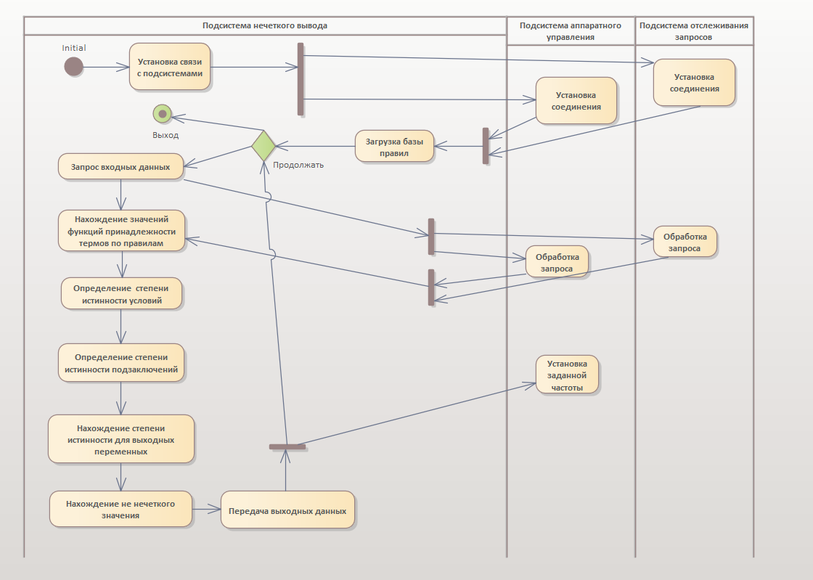

 

  

  <h3 align="center">Fuzzy-Output* - Описание и разработка</h3>

  

    Система управления на основе принципов нечеткого множества
     
    <a href="#"><strong>Описание и разработка »</strong></a> ▪
    <a href="#"><strong>Разработка »</strong></a> ▪
    <a href="#"><strong>Тестирование »</strong></a>
     
     
  

  

    <small><i>*Проект выполнен в рамках курса дисциплины «Нечеткие методы обработки и анализа данных» в ходе обучения в <strong>Донецком Национальном техническом университете</strong></i></small>
  

## Назначение системы

Разрабатываемая система предназначена для автоматического разгона частоты центрального процессора сервера в зависимости от различных параметров окружающей среды, в их числе: количество обрабатываемых запросов и количество оперативной памяти. Данная система работает с нечеткой логикой и называется системой с нечетким выводом. Данная система может выступать как часть автоматической надстройки на сервере для оптимизации запросов.

Понятие нечеткого вывода занимает ключевое положение в нечеткой логике и теории управления нечеткими системами. В контексте нечеткой логики в системах управления, систему нечеткого вывода можно определить как процесс формирования нечетких выводов о необходимом управлении объектом на основе размытых условий или предпосылок, содержащих информацию о текущем состоянии объекта.

Цель создания нечеткой информационной системы заключается в достижении нижеперечисленных показателей и результатов.
1.	Оптимизация работы серверов. Целью системы является обеспечение оптимального функционирования серверных систем. Достижение этой цели будет измеряться улучшением эффективности использования вычислительных ресурсов и снижением операционных затрат.

2.	Увеличение эффективности вычислительных ресурсов. Система стремится к повышению эффективности использования вычислительных ресурсов, предоставляя необходимые ресурсы в зависимости от текущей нагрузки и обеспечивая стабильность работы серверов в условиях переменной нагрузки.

3.	Снижение операционных затрат Целью системы является снижение операционных затрат за счет оптимизации работы вычислительных систем и предотвращения избыточного потребления ресурсов.

4.	Обеспечение стабильности работы серверов. Система создается с учетом обеспечения стабильности работы серверов в условиях переменной нагрузки. Адаптивное управление параметрами сервера на основе анализа данных позволяет минимизировать риски возможных сбоев и обеспечивать бесперебойную работу.

В общем случае система должна выдавать приближенный к оптимальному значению результат.

## Формирование базы правил системы нечеткого вывода

База правил системы нечеткого вывода предназначена для формального представления эмпирических знаний экспертов в той или иной проблемной области. База правил системы нечеткого вывода представляет собой конечную совокупность нечетких правил, согласованную относительно используемых в них лингвистических переменных.

В системах нечеткого вывода лингвистические переменные, которые используются в нечетких высказываниях подусловий нечетких правил, часто называют входными лингвистическими переменными. А переменные, которые используются в нечетких высказываниях подзаключений правил нечетких продукций, часто называют выходными лингвистическими переменными [[1](http://nrsu.bstu.ru/chap27.html)].

В частном случае, имеем две входные лингвистические переменные: интенсивность обращений к серверу (запросов/мин), количество оперативной памяти (Мб) и  выходную – частота процессора.

## Алгоритм решения задачи

В качестве алгоритма решения задачи представим диаграмму деятельности между подсистемами, отображающую общий процесс работы программ без акцентирования внимания на деталях

## Объектная модель

Разработку объектной модели начнем с описания классов на одноименной диаграмме. В процессе разработки заранее отделим алгоритмическую часть от интерфейсной, чтобы была возможность применить алгоритм на другом представлении и не быть зависимым от интерфейса пользователя

