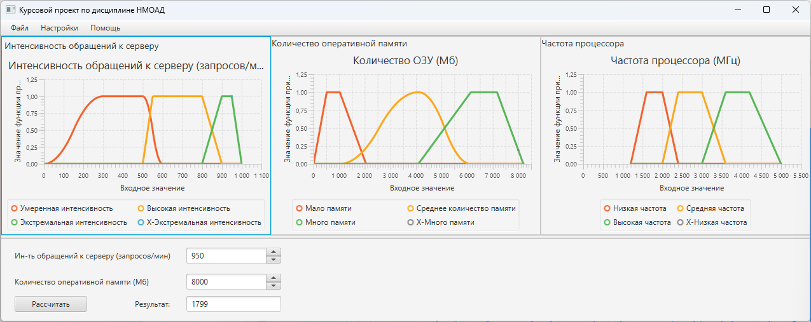

<a name="readme-top"></a>

<a>RU</a> | <a href="../README.md">EN</a>

<!-- PROJECT LOGO -->
<br />
<div align="center">
  <a href="https://donntu.ru/" target="_blank">
    
  </a>

  <h3 align="center">Fuzzy-Output*</h3>

  <p align="center">
    Система управления на основе принципов нечеткого множества
    <br />
    <a href="#"><strong>Описание »</strong></a> ▪
    <a href="#"><strong>Разработка »</strong></a> ▪
    <a href="#"><strong>Тестирование »</strong></a>
    <br />
    <br />
  </p>
  <p align="right">
    <small><i>*Проект выполнен в рамках курса дисциплины «Нечеткие методы обработки и анализа данных» в ходе обучения в</br><strong>Донецком Национальном техническом университете</strong></i></small>
  </p>
</div>


## О проекте



Данный проект представляет собой курсовую работу на тему «Система управления на основе принципов нечеткого множества». Выполнена в ходе обучения в магистратуре в ФГБОУ ВО ДонНТУ в 2023 году. Целью выполнения курсовой работы было освоение основных понятий и принципов построения систем принятия решений с использованием нечеткой логики, изучение основных методологий проектирования и способов реализации таких систем.

Основной задачей данной курсовой работы была разработка системы, позволяющей проводить анализ входных данных сервера в режиме реального времени и принимать обоснованные решения, ориентируясь на реализованные алгоритмы нечеткой логики.

Реализация системы выполнялась с использованием языка программирования Java и библиотекой для создания пользовательских интерфейсов JavaFX.

<p align="right">(<a href="#readme-top">наверх</a>)</p>


## Приступая к работе

Чтобы запустить локальную копию системы, выполните следующие простые действия.

### Компоненты

Убедитесь, что у вас установлены следующие компоненты:

* Oracle Java 11
* Apache Maven 3.9.8

### Установка

1. Клонируйте репозиторий
  ```sh
    git clone https://gitflic.ru/project/sabitovka/fuzzy-output
  ```
2. Скомпилируйте проект с помощью Maven
  ```sh
    mvn clean compile
  ```
3. Запустите систему
  ```sh
    mvn javafx:run
  ```

<p align="right">(<a href="#readme-top">наверх</a>)</p>


## Использование

Разработанная система предназначена для установки частоты центрального процессора на основе нечетких правил интенсивности обращений к серверу и количества оставшейся ОЗУ. На форму заносится информация о текущем количестве обращений к серверу и интенсивности обращений, после чего отображается рекомендованная частота процессора


Нечеткие правила, которые представлены термами лингвистических переменных и функциями принадлежности можно редактировать. Для этого исползьуется форма настроек. Каждую лингвистическую переменную можно расширить набором термов. Каждый терм можно настроить на один из следующих функций принадлежности:

* Квадратичная
* Линейная
* Экспоненциальная


<p align="right">(<a href="#readme-top">наверх</a>)</p>


## Вклад

Вклады - это то, что делает сообщество разработчиков с открытым исходным кодом замечательным местом для обучения, вдохновения и творчества. Я **высоко оценю любой ваш вклад**.

Если у вас есть предложения по улучшению системы, сделайте Форк и создайте Запрос на слияние. Также вы можете создать issue с тегом "enhancement"

1. Сделайте Форк проекта
2. Создайте новую ветку фичи (`git checkout -b feature/your-feature`)
3. Закоммитте изменения (`git commit -m 'Добавлена новая фича'`)
4. Запуште изменения (`git push origin feature/your-feature`)
5. Создайте запрос на слияние

<p align="right">(<a href="#readme-top">наверх</a>)</p>

## Лицензия

Распространяется по лицензии MIT. Дополнительную информацию смотрите в файле "LICENSE.txt`.

<p align="right">(<a href="#readme-top">наверх</a>)</p>

## Контакты

Карим Сабитов
* [VK](https://vk.com/id87074050)
* [karim.sab@yandex.ru](mailto://karim.sab@yandex.ru)

Другие ссылки на проект:
* GitHub - [https://github.com/sabitovka/fuzzy-output](https://github.com/sabitovka/fuzzy-output)
* GitFlic - [https://gitflic.ru/project/sabitovka/fuzzy-output](https://gitflic.ru/project/sabitovka/fuzzy-output)

<p align="right">(<a href="#readme-top">наверх</a>)</p>